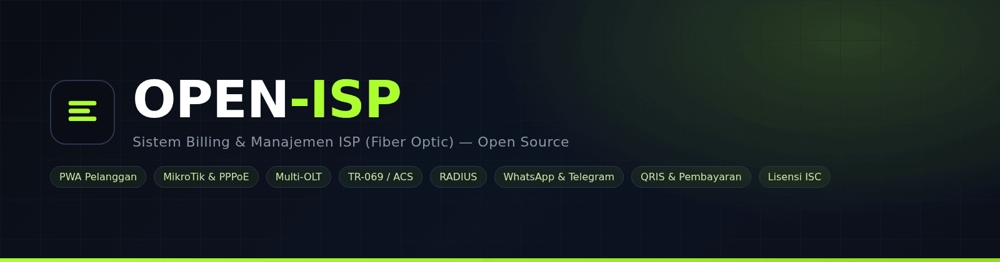
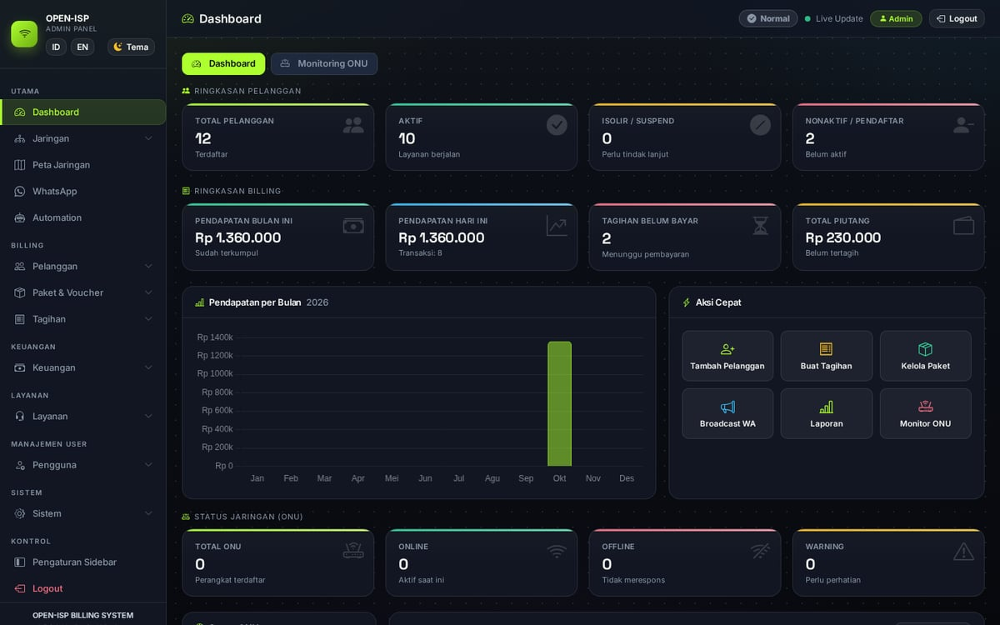
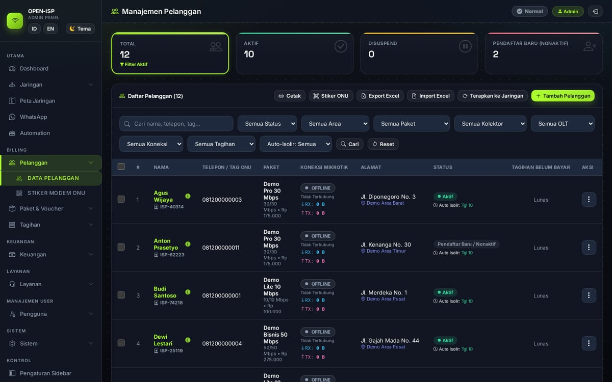
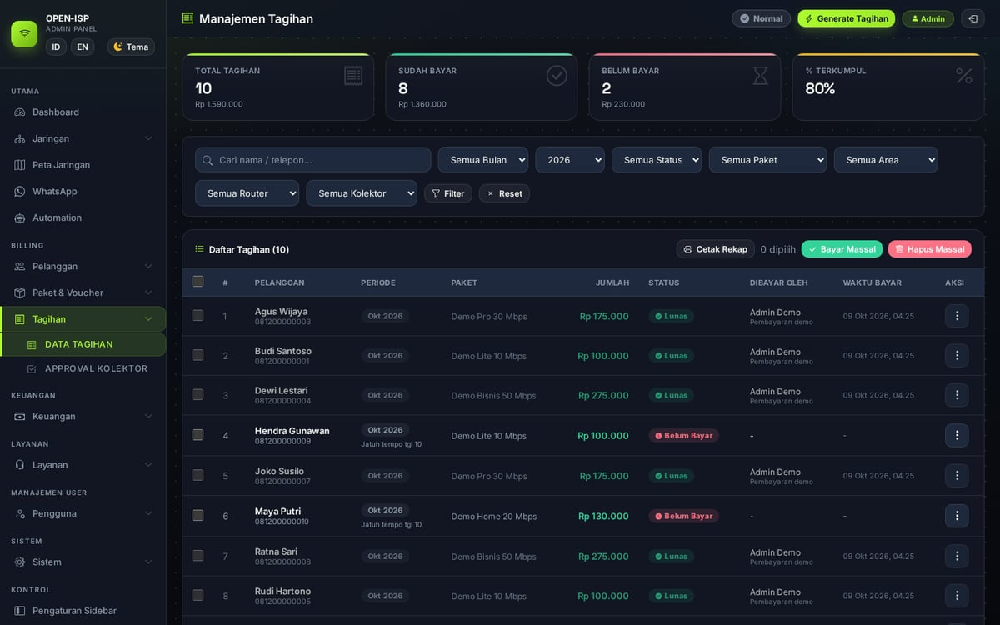
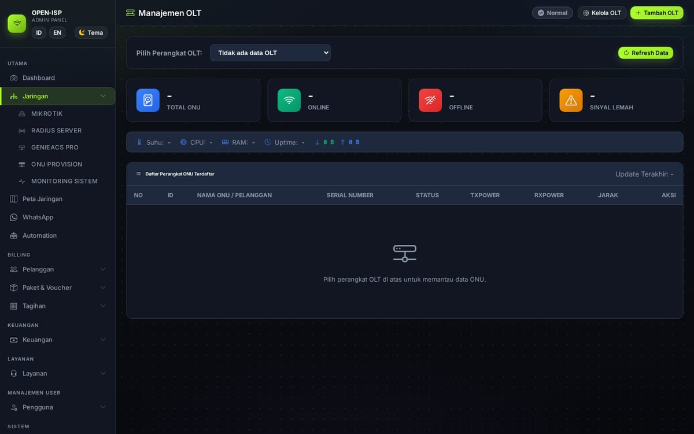
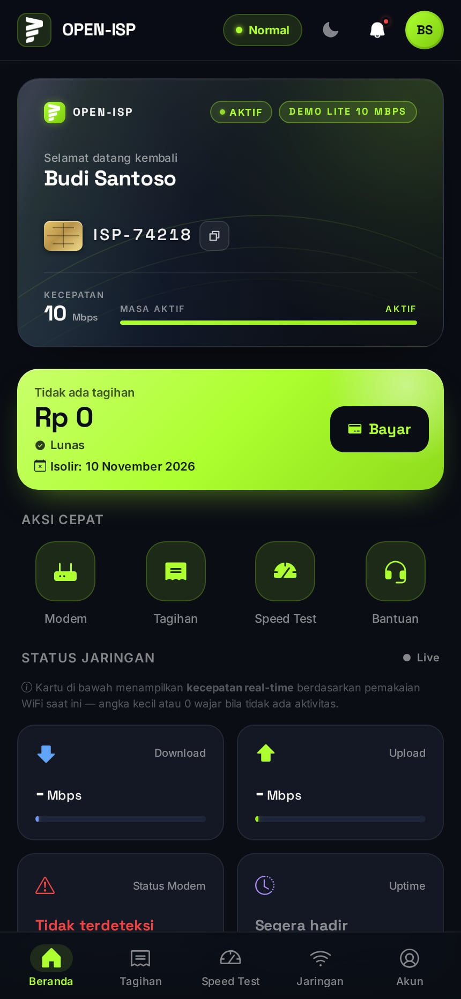
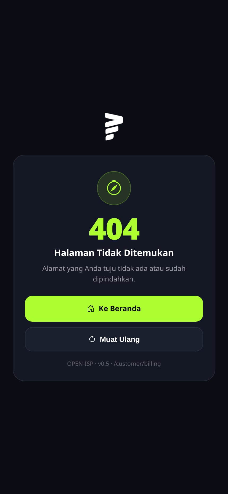

<p align="center">
  
</p>

<p align="center">
  <b>Sistem billing &amp; manajemen ISP (fiber optic) — open source, self-hosted.</b><br>
  PWA pelanggan · Panel admin · Portal teknisi &amp; kolektor · Multi-OLT · RADIUS · WhatsApp/Telegram · QRIS
</p>

<p align="center">
  
  
  = 20">
  
  
  
  
</p>

---

**OPEN-ISP** adalah aplikasi billing dan manajemen ISP yang lengkap: tagihan otomatis, isolir otomatis, pembayaran (QRIS/webhook), perangkat MikroTik (PPPoE & hotspot), OLT PON multi-vendor, TR-069 (GenieACS/ACS), RADIUS, peta jaringan, notifikasi WhatsApp & Telegram, hingga portal self-service pelanggan dalam satu platform — semuanya berjalan mandiri (self-hosted) dengan SQLite sebagai basis data. **NOTE:** dibuat dan ditulis oleh AI ([Deepseek](https://github.com/deepseek-ai)), on opencode).

## Fitur

- **Billing & pembayaran** — tagihan bulanan otomatis (cron tanggal 1), promo & prorata per paket, kode unik/QRIS, konfirmasi bukti transfer, webhook notifikasi pembayaran, cetak invoice, bayar tunggal/massal, void/unpay.
- **Otomatisasi** — isolir otomatis (harian, per pelanggan + hari isolir), pengingat tagihan via WhatsApp, jam kalong (profil malam), FUP (turun profil saat kuota habis), sinkron pemakaian PPPoE berkala.
- **MikroTik** — multi-router, PPPoE & hotspot, voucher hotspot, monitor trafik, tes koneksi, setup firewall, backup konfigurasi, dukungan RouterOS 7 (API + TLS).
- **OLT PON multi-vendor** — Hioso & HSGQ (SNMP), ZTE & Huawei (CLI/Telnet): statistik ONU, reboot/rename/otorisasi, konfigurasi WAN/OMCI. Tersedia `scripts/olt-probe.js` untuk mendeteksi OLT baru.
- **TR-069 (GenieACS/ACS)** — daftar perangkat, ubah SSID/password Wi-Fi, reboot, operasi massal.
- **RADIUS** — server PAP/CHAP untuk PPPoE/hotspot, secret per-NAS.
- **Peta & GIS** — Leaflet + OpenStreetMap/satelit: marker pelanggan & ODP, jalur kabel, trafik PPPoE real-time; peta teknisi + rute Google Maps.
- **Portal & peran** — admin (super admin/admin/kasir), teknisi (tiket, input pelanggan dari lapangan), kolektor (cek tagihan & pengajuan pembayaran), dan **PWA pelanggan** (tagihan, bayar, tiket, SSID/password, speed test, mode offline).
- **Notifikasi** — WhatsApp (gateway GoWA atau bot Baileys bawaan): broadcast, pengingat otomatis, struk pembayaran; bot Telegram admin (opsional).
- **Speed test** — server internal maupun eksternal (preset provider diatur admin), mode embed/tab, tombol Muat Ulang & Bersihkan Cache.
- **PWA** — dapat dipasang di HP, offline, pembaruan otomatis (bar "versi baru tersedia").
- **Bilingual** — antarmuka Indonesia / English (bisa diganti dari UI).
- **Lain-lain** — inventaris gudang, tiket dukungan, laporan, monitoring sistem (CPU/RAM/disk), ODP, backup/restore database, audit log.

## Tangkapan Layar

<table>
<tr>
<td align="center"><b>Dashboard Admin</b><br></td>
<td align="center"><b>Data Pelanggan</b><br></td>
</tr>
<tr>
<td align="center"><b>Tagihan &amp; Pembayaran</b><br></td>
<td align="center"><b>OLT (PON)</b><br></td>
</tr>
<tr>
<td align="center"><b>Portal Pelanggan (PWA)</b><br></td>
<td align="center"><b>Tagihan Pelanggan</b><br></td>
</tr>
</table>

Selengkapnya: **[Wiki OPEN-ISP](https://github.com/oxpoe/open-isp/wiki)**.

## Mulai Cepat

### Docker (disarankan)

```bash
git clone https://github.com/oxpoe/open-isp.git
cd open-isp
docker compose up -d
```

Buka **http://localhost:3001** — login awal `admin` / `demo-isp123` (**segera ganti password**).
Data tersimpan di volume `docker-data/` (settings, database, logs, uploads, sesi WhatsApp).

### Manual (Node.js ≥ 20, disarankan 22 LTS)

```bash
npm ci --omit=dev
npm start
```

Opsional: `cp env-example.txt .env` untuk mengisi rahasia webhook pembayaran.

### Data demo (opsional)

```bash
node scripts/seed-demo.js
```

Menambahkan paket, area, 12 pelanggan contoh, tagihan, dan tiket. Login pelanggan demo: `081200000001` / `demo-isp123`.

## Aktivasi Menu Lanjutan

Beberapa menu lanjutan terkunci secara bawaan dan bisa dibuka dengan memasukkan kode aktivasi.
Aktivasi bersifat **gratis** (tanpa donasi). Demi keamanan, kode aktivasi **tidak dipublikasikan
di repositori ini** — setiap pemilik instalasi dapat mengaturnya di `settings.json`
(kunci `activation_code`) dan membagikannya melalui kanalnya masing-masing.
Dukungan sukarela tetap diterima lewat menu **Dukung OPEN-ISP** di aplikasi.

## Dokumentasi

- [`docs/`](docs/) — referensi teknis (skema database, OID OLT, integrasi RADIUS/MikroTik, checklist backup, dll.).
- [Wiki](https://github.com/oxpoe/open-isp/wiki) — panduan instalasi, konfigurasi, tutorial, FAQ (sedang disusun).
- [Issues](https://github.com/oxpoe/open-isp/issues) — laporan bug & permintaan fitur.

## Teknologi

Node.js · Express · EJS · better-sqlite3 (SQLite) · Bootstrap 5 + Bootstrap Icons (vendor lokal) · Leaflet · PWA/Service Worker · sharp · net-snmp · MikroTik RouterOS API · Baileys / GoWA · Telegram Bot API.

## Lisensi &amp; Kredit

Dirilis dengan lisensi **ISC** — bebas digunakan, dimodifikasi, dan didistribusikan ulang (sertakan lisensi). Lihat [`LICENSE`](LICENSE).

- **Base kode &amp; repo**: [alijayanet/billing-rtrw](https://github.com/alijayanet/billing-rtrw) — dibuat oleh **Alijaya Net**. Terima kasih banyak atas base kode dan repo yang bermanfaat.
- **Add-on**: GoWA (WhatsApp gateway), LibreSpeed & OpenSpeedTest (speed test), Uptime Kuma (monitoring, opsional), notification-forwarder.
- **Dikembangkan oleh** [oxpoe](https://github.com/oxpoe) — **code by DeepSeek V4.1 Flash — max, on opencode**.
- Terima kasih untuk para kontributor dan komunitas ISP Indonesia.

## Dukungan &amp; Donasi

OPEN-ISP tumbuh dari karya **Alijaya Net** — ayo dukung juga pengembang aslinya:

- **Donasi Alijaya Net**: [app.alijaya.com/donasi](https://app.alijaya.com/donasi) · WhatsApp [0819-4721-5703](https://wa.me/6281947215703)

Dukungan untuk **pengembangan OPEN-ISP** (agar makin canggih): link donasi **menyusul** — sementara ini bisa lewat menu **Dukung OPEN-ISP** di aplikasi.

---

## English (quick)

**OPEN-ISP** is an open-source ISP billing & management system: customer PWA, admin/technician/collector portals, MikroTik PPPoE & hotspot, multi-vendor OLT (SNMP/CLI), GenieACS TR-069, RADIUS, WhatsApp & Telegram notifications, QRIS payments, and a bilingual (ID/EN) UI.

Quick start: `docker compose up -d` → http://localhost:3001 (default login `admin` / `demo-isp123`).
Advanced menus are unlocked with a free activation code — not published in this repository (set via `activation_code` in `settings.json`). License: **ISC**. Based on the base code & repo by **Alijaya Net** ([alijayanet/billing-rtrw](https://github.com/alijayanet/billing-rtrw)). Code by DeepSeek V4.1 Flash — max, on opencode.
