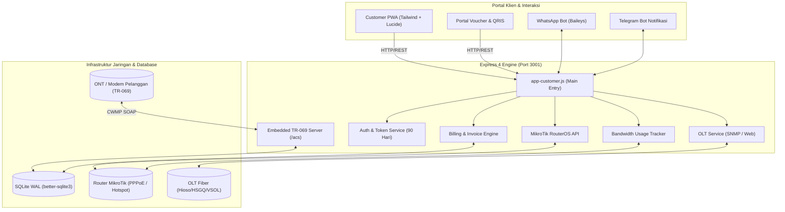
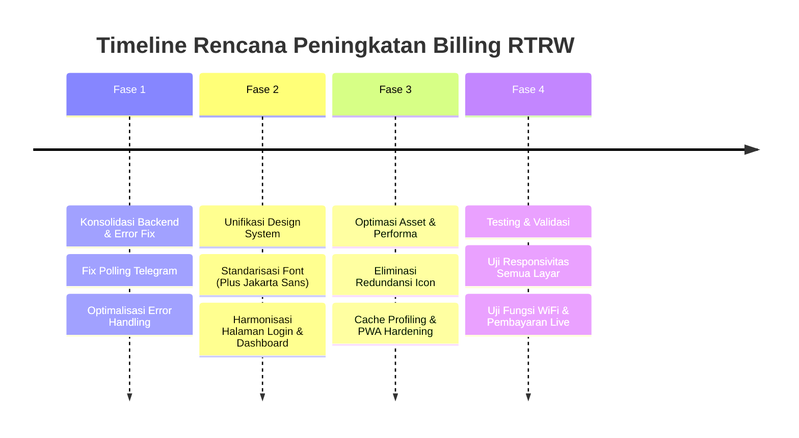

# Analisis Komprehensif Sistem, Logika Backend, dan UI/UX — Billing RT/RW Net

> **Target Project**: `/opt/billing-rtrw` (VPS `deneva` — `116.212.74.115`)  
> **Layanan**: `billing-rtrw.service` (Node.js v20+, port `3001`)  
> **Repository Asal**: `https://github.com/alijayanet/billing-rtrw`  
> **Repository Fork/Deploy**: `https://github.com/alijayanet/billing-rtrw`

---

## 1. Ringkasan Eksekutif & Gambaran Sistem

Billing RT/RW Net ini adalah sistem manajemen operasional ISP (Internet Service Provider) berbasis komunitas yang memadukan:
1. **Billing & Invoicing**: Siklus tagihan bulanan, isolir otomatis, dan pembayaran QRIS dinamis/manual.
2. **Network Automation**: Integrasi RouterOS MikroTik (PPPoE, Hotspot Voucher, Simple Queue, Address List).
3. **Hardware Management (FTTH)**: Embedded ACS TR-069 Server (CWMP) untuk manajemen ONT klien dan SNMP OLT (EPON/GPON).
4. **Customer Self-Service (PWA)**: Portal pelanggan mobile-first dengan auto-login 90 hari, ganti WiFi SSID/password mandiri, grafik pemakaian kuota/bandwidth, dan reboot modem.
5. **Multi-Channel Bot**: Bot WhatsApp (Baileys socket) dan Bot Telegram untuk notifikasi, penagihan, dan tiket operasional.



---

## 2. Analisis Backend & Logika Alur Fungsi

### 2.1 Arsitektur Server & Runtime
* **Runtime**: Node.js `>=20.0.0` (Native ES Module + CommonJS hybrid).
* **Database Engine**: SQLite 3 melalui `better-sqlite3` dengan mode **WAL (Write-Ahead Logging)**, foreign keys aktif, sinkronisasi file cepat dan hemat resource.
* **Proses Lifecycle**: Dikelola oleh Systemd (`billing-rtrw.service`) dengan auto-restart `on-failure` (delay 5 detik), batas memori RAM `--max-old-space-size=512`.
* **Proteksi Server**:
  * Penanganan `unhandledRejection` dan `uncaughtException` terpusat agar error koneksi (misal timeout MikroTik) tidak mematikan server Express.
  * Fallback port otomatis (`startServer` mencoba port +1000 jika port 3001 bentrok).
  * Proteksi CSRF berbasis validasi header `Origin` dan `Referer` (mengecualikan webhook dan endpoint SOAP ACS).

---

### 2.2 Modul-Modul Inti & Alur Logika

#### A. Layanan Billing, Invoice & Isolir (`services/billingService.js` & `services/cronService.js`)
* **Logika Pembuatan Tagihan**:
  1. Cron berjalan setiap hari (`cronService.js`) memeriksa seluruh pelanggan aktif.
  2. Tagihan dibuat otomatis setiap siklus tanggal tagihan (`billing_date`) untuk periode bulan berjalan.
  3. Kode unik nominal QRIS (`qris_amount_unique`) diinjeksi 3 digit acak (1–999) agar mutasi bank/QRIS dapat dicocokkan otomatis tanpa payment gateway berbayar.
* **Logika Isolir Otomatis**:
  1. Bila tanggal saat ini mencapai atau melewati `isolir_day` (default tanggal 20 tiap bulan) dan tagihan pelanggan masih `unpaid`:
  2. Status pelanggan di database diubah menjadi `isolated`.
  3. `mikrotikService` dipanggil untuk memindahkan secret PPPoE ke profile isolir atau memasukkan IP klien ke Address List `ISOLIR` di MikroTik Firewall.
  4. Sesi aktif diputus (`disconnectPPPoE`) sehingga pelanggan ter-redirect ke halaman Walled Garden (`/isolated`).

#### B. Layanan TR-069 ACS Server (`services/acsServerService.js` & `/acs`)
* **Protokol**: CWMP (CPE WAN Management Protocol) via SOAP XML over HTTP POST.
* **Alur Inform & Handshake**:
  1. Modem (ONT) mengirim HTTP POST `Inform` ke endpoint `/acs`.
  2. Server memeriksa header `Authorization`. Jika belum diautentikasi, server membalas dengan **HTTP 401 Unauthorized** (Digest Challenge).
  3. Modem mengirim kembali request dengan Digest Hash yang dihitung berdasarkan username (`skyfiber`) dan password acak perangkat.
  4. Server membaca parameter XML (`Device.DeviceInfo.*`, `Device.WANDevice.*`, `Device.Ethernet.*`, `Device.LANDevice.*`).
  5. Data kekuatan redaman optik (`RXPower`, `TXPower`), serial number, model, dan versi software disimpan ke tabel `acsdevices`.
  6. Server memeriksa antrean tugas (task queue) per perangkat: jika ada perintah ganti password WiFi atau reboot, server merespons dengan `SetParameterValues` atau `Reboot`.

#### C. Pengelolaan WiFi Multi-Vendor (`services/customerDeviceService.js`)
* **Masalah Klasik**: Tiap vendor modem (Huawei, ZTE, FiberHome, Nokia) memiliki skema OID/TR-098 yang berbeda-beda. Mengirim parameter yang salah menyebabkan SOAP Fault 9007.
* **Logika Adaptif Per-Vendor**:
  * **Huawei / FiberHome / Nokia**: Memprioritaskan `PreSharedKey.1.KeyPassphrase` dan menghindari pengiriman hex 64-digit bersamaan dengan plain string.
  * **ZTE / ZICG / CIOT**: Memprioritaskan `KeyPassphrase` top-level.
  * **Dual-Band SSID**: Mengatur `WLANConfiguration.1.SSID` (2.4 GHz) dan `WLANConfiguration.5.SSID` (5 GHz) secara independen tanpa merusak konfigurasi guest SSID.

#### D. Integrasi Jaringan MikroTik (`services/mikrotikService.js`)
* **Koneksi**: RouterOS API (port default `25722`/`8728`) menggunakan library `routeros-client`.
* **Fitur Utama**:
  * Sinkronisasi PPPoE: Read active connections, update secret passwords, kick active sessions.
  * Monitoring Traffic: Mengambil data byte RX/TX interface pelanggan untuk kalkulasi kuota.
  * Voucher Hotspot: Direct injection user hotspot, profile rate-limit, dan validitas voucher.

#### E. Autentikasi Pelanggan & Persistent Token (`services/customerAuthTokenService.js`)
* **Alur Sesi PWA**:
  1. Pelanggan memasukkan nomor HP / ID Pelanggan.
  2. Saat login berhasil, backend men-generate token kriptografi acak `crypto.randomBytes(32).toString('hex')`.
  3. Token di-hash dengan SHA-256 dan disimpan di tabel SQLite `customer_auth_tokens` dengan masa berlaku 90 hari.
  4. Plain token dikirimkan ke browser sebagai cookie `customer_remember` (`httpOnly`, `secure`, `sameSite: lax`).
  5. Ketika pengguna membuka PWA (bahkan setelah browser/HP di-restart), middleware auto-login memverifikasi cookie ini dan merekonstruksi session secara transparan.

#### F. Pelacakan Kuota & Pemakaian Bandwidth (`services/usageService.js`)
* **Logika Agregasi**:
  1. Mengambil byte delta dari MikroTik queue / interface.
  2. Menyimpan sampel agregat harian dan bulanan ke database.
  3. Menyediakan API untuk konsumsi frontend (Chart.js di dashboard pelanggan).

---

## 3. Analisis UI / UX, Styling, Typografi & Layout

Pemeriksaan mendalam terhadap template EJS dan file CSS/JS di `/opt/billing-rtrw/views/` dan `/opt/billing-rtrw/public/` mengungkap sejumlah temuan penting mengenai styling, engine, dan konsistensi desain:

### 3.1 Peta Engine & Library UI per Portal

| Portal / Halaman | Engine CSS Utama | Library Icon | Font Family Utama | Style Pendekatan |
|---|---|---|---|---|
| **Customer Dashboard** (`views/dashboard.ejs`) | **Tailwind CSS 3.4.17** (via CDN) | **Lucide Icons** (v1.48.0) + FontAwesome 6.4.0 | **Plus Jakarta Sans** (Google Fonts) | Modern App Shell / Glassmorphism Mobile-first |
| **Customer Login** (`views/login.ejs`) | **Bootstrap 5.3.2** (CDN) | **Bootstrap Icons 1.11.3** | **System Font Stack** (`-apple-system`, Segoe UI, Roboto) | Centered Glass Card / Radial Background |
| **Admin Portal** (`views/admin/*`) | **Custom CSS** (`/css/admin.css`) | **Bootstrap Icons 1.11.3** + FontAwesome | **Inter** (Google Fonts) | Desktop Enterprise Sidebar & Table Layout |
| **Teknisi Portal** (`views/tech/*`) | **Bootstrap 5** + `/css/theme.css` | **Bootstrap Icons** | System Font / Inter | Mobile Bottom Navigation |
| **Halaman Peta Jaringan** (`views/admin/map.ejs`) | **Leaflet 1.9.4** + `/css/admin.css` | FontAwesome + SVG Animasi | Inter | Fullscreen Interactive Map & Vector Layer |

---

### 3.2 Analisis Typografi & Hierarki Font

```
[Customer Dashboard]   Plus Jakarta Sans (300, 400, 500, 600, 700, 800)
       ├── Title / Header     : text-base sm:text-lg font-bold (Tracking tight)
       ├── Section Labels     : text-xs font-semibold text-slate-400 uppercase (Tracking wider)
       ├── Body / Konten      : text-sm font-normal text-slate-200 (Leading relaxed)
       └── Badges & Metadata  : text-[10px] sm:text-xs font-medium

[Customer Login]       System Font Stack (BlinkMacSystemFont, Segoe UI, Roboto)
       └── Ketidaksesuaian    : Font berbeda dengan Dashboard; saat user login terjadi visual jump dari font sistem ke Plus Jakarta Sans.

[Admin Portal]         Inter (300, 400, 500, 600, 700, 800)
       ├── Sidebar Items      : font-size 13px, font-weight 500
       ├── Data Table Header  : font-size 11px, text-transform uppercase, letter-spacing 0.5px
       └── Table Data Cells   : font-size 13px, color var(--text: #e6edf3)
```

---

### 3.3 Analisis Styling, Palette Warna & Tema Gelap/Terang

#### Palette Warna Dominan
1. **Mode Gelap (Customer Dashboard)**:
   * Background Utama: `#0b0f19` (Deep Blue-Black)
   * Card & Panel: `#1e293b` (Slate 800) dengan border `#334155` (Slate 700)
   * Aksen Primer (Brand): Gradasi Teal `#14b8a6` ke Cyan `#06b6d4`
   * Aksen Sekunder: Indigo `#6366f1`
   * Status Indikator: Hijau Sukses `#10b981`, Merah Warning/Error `#f43f5e`, Amber `#f59e0b`
2. **Mode Terang (Customer Dashboard & Global Theme)**:
   * Background Utama: `#f1f5f9` (Slate 100)
   * Card & Panel: `#ffffff` murni dengan border `rgba(15, 23, 42, 0.08)`
   * Teks Utama: `#0f172a` (Slate 900), Teks Muted: `#64748b` (Slate 500)
3. **Mekanisme Tema (Theming Engine)**:
   * Terdapat dua sistem tema yang berjalan berdampingan:
     * `views/dashboard.ejs` menggunakan script lokal inline (`localStorage: skyfiber-customer-theme`) mengendalikan class `dark` pada `<html>` untuk Tailwind.
     * Portal lainnya menggunakan `/js/theme.js` dan `/css/theme.css` (`localStorage: app-theme`) mengendalikan atribut `data-theme="light|dark"`.
   * Pada rilis `v1.9.4`, kedua key ini sudah disinkronkan, namun styling mode terang di portal admin masih membutuhkan penyesuaian kontras pada beberapa tabel dan modal.

---

### 3.4 Analisis Layout, Spacing, Alignment & UX

#### 1. Customer Dashboard (Mobile App Shell)
* **Alignment & Container**:
  * Lebar maksimum dibatasi ke `max-w-md` atau `max-w-lg` di tengah layar (`mx-auto`), memberikan rasa native mobile application saat dibuka di smartphone maupun desktop browser.
  * Padding konten konsisten (`px-4 py-3`), dengan padding bawah ekstra (`pb-28`) untuk memberi ruang bagi floating navigation dock.
* **Floating Glass Dock (5 Tab Navigasi)**:
  * Terpasang fixed di bagian bawah layar: `fixed bottom-4 left-1/2 -translate-x-1/2`.
  * Menggunakan efek glassmorphism (`backdrop-blur-md`, background semi-transparan, border tipis halus).
  * Indikator aktif berupa **sliding pill** yang bergerak halus mengikuti tab yang diklik (`updatePillPosition`).
  * Tab navigasi:
    1. `tab-beranda` (Home, status paket, kuota, shortcut aksi)
    2. `tab-router` (Status ONT, redaman fiber optic, ganti WiFi, reboot)
    3. `tab-ppob` (Layanan isi pulsa & token listrik - status Coming Soon)
    4. `tab-tagihan` (Riwayat invoice, tombol bayar QRIS)
    5. `tab-profile` (Data akun, riwayat tiket kendala, tombol CS WhatsApp, logout)
* **Kerapian & Touch Target**:
  * Seluruh tombol interaktif memiliki ukuran touch-target minimal `40x40px` (ramah sentuhan jari di layar HP).
  * Safe-area-insets untuk iPhone (`env(safe-area-inset-bottom)`) sudah ditambahkan pada `.dock-glass`.

#### 2. Admin & Staff Portal
* **Layout**:
  * Sidebar navigasi di sisi kiri (`width: 240px`, fixed).
  * Konten utama di sebelah kanan dengan header fixed dan breadcrumb.
  * Responsive breakpoint: Pada layar kecil (mobile), sidebar disembunyikan dan diakses lewat toggle menu hamburger.

---

### 3.5 Temuan Evaluasi & Celah UI/UX (Bottlenecks)

1. **Fragmentasi Framework CSS**:
   * Halaman login menggunakan **Bootstrap 5**, sedangkan dashboard pelanggan menggunakan **Tailwind CSS**. Ini membebani browser pengguna karena harus mengunduh dua framework CSS besar saat pertama kali membuka aplikasi.
2. **Ketergantungan CDN Runtime (Client-Side Tailwind)**:
   * Dashboard pelanggan menggunakan `<script src="https://cdn.tailwindcss.com/3.4.17"></script>`. CDN ini mem-parse class Tailwind saat runtime di perangkat klien (JIT compiler di browser), yang dapat memperlambat rendering awal (First Contentful Paint) pada ponsel berspesifikasi rendah.
3. **Dual Icon Libraries**:
   * Halaman dashboard memuat **Lucide Icons** dan **FontAwesome 6.4.0** secara bersamaan. FontAwesome (file CSS + font ~400KB) hanya digunakan untuk segelintir ikon kecil, sementara sebagian besar UI sudah menggunakan SVG Lucide.
4. **Log Error Berulang di Backend**:
   * Terdapat log `Telegram Polling Error` berkala pada journal server deneva karena token bot belum dikonfigurasi / timeout koneksi ke server Telegram API.

---

## 4. Rencana Kerja Terperinci (Execution Plan)

Rencana perubahan ini dibagi menjadi 4 fase berurutan dengan prinsip **zero-downtime** dan keamanan data:



### Fase 1: Perbaikan Stabilitas & Logika Backend
1. **Fix Polling Telegram (`services/telegramBot.js`)**:
   * Tambahkan pengecekan kondisi: jika token Telegram kosong, nonaktifkan `polling: true` agar tidak membanjiri log server dengan polling error setiap 5 detik.
2. **Peningkatan Ketahanan Koneksi MikroTik (`services/mikrotikService.js`)**:
   * Implementasikan retry backoff otomatis saat query queue/PPPoE timeout, menghindari uncaught exception yang tidak perlu.
3. **Audit Query Database (`config/database.js`)**:
   * Periksa indeks pada tabel `pppoe_traffic_samples`, `invoices`, dan `customer_auth_tokens` untuk mempercepat query bulanan.

### Fase 2: Harmonisasi UI/UX & Standarisasi Tipografi
1. **Standarisasi Tipografi**:
   * Terapkan font **Plus Jakarta Sans** ke seluruh halaman pelanggan, termasuk halaman Login (`views/login.ejs`), Register, dan Isolir (`views/isolated.ejs`), menggantikan system font default agar pengalaman visual konsisten sejak awal.
2. **Harmonisasi Desain Halaman Login (`views/login.ejs`)**:
   * Rombak halaman login agar memiliki nuansa tema, sudut rounded, dan aksen warna Teal/Cyan yang identik dengan Dashboard Pelanggan.
   * Ganti elemen Bootstrap pada halaman login menjadi layout yang selaras dengan tema dashboard.
3. **Penyempurnaan Form Ganti WiFi di Tab Router**:
   * Perjelas instruksi frekuensi 2.4 GHz vs 5 GHz.
   * Tambahkan toggle visibility (mata) untuk password WiFi dan validasi panjang password (minimal 8 karakter) di sisi klien sebelum submit.

### Fase 3: Optimasi Frontend & Efisiensi Aset
1. **Rasionalisasi Icon**:
   * Migrasikan sisa ikon FontAwesome di Dashboard pelanggan ke **Lucide Icons** bawaan.
   * Hapus pemanggilan CSS FontAwesome di dashboard pelanggan untuk menghemat ukuran transfer data hingga ~400 KB.
2. **Optimasi Mode Terang (Light Mode)**:
   * Periksa dan rapikan kontras teks di seluruh tab dashboard agar tidak ada teks putih yang tidak terbaca saat berganti ke background terang.
   * Pastikan border card dan form input terlihat tegas pada mode terang.

### Fase 4: Pengujian, Validasi & Deployment
1. **Uji Coba Lintas Perangkat**:
   * Uji tampilan di mobile (Android Chrome, iOS Safari), tablet, dan desktop.
   * Uji fungsi PWA Add to Home Screen dan verifikasi auto-login setelah kill aplikasi.
2. **Uji Fungsional End-to-End**:
   * Uji ganti SSID/password pada modem online.
   * Uji alur pembuatan invoice dan QRIS.
   * Restart service `billing-rtrw.service` dan verifikasi log bersih tanpa error.
