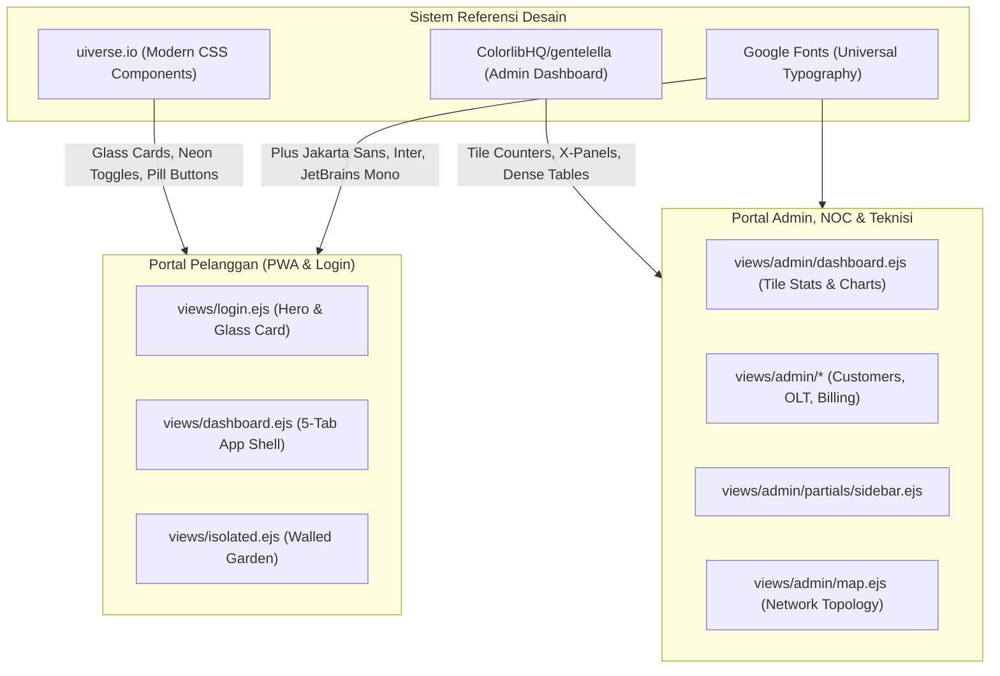

# Rencana Desain & Modernisasi UI/UX — Billing RT/RW Net
*(Mengadopsi Referensi uiverse.io, ColorlibHQ/gentelella, dan Google Fonts)*

> **Status Server Biznet**: ✅ **Berhasil Dimatikan & Dinonaktifkan** (`systemctl stop/disable`, `pm2 stop/delete`). Tidak ada lagi tabrakan bot Telegram ataupun service jaringan.  
> **Server Produksi Aktif**: VPS `deneva` (`116.212.74.115` — port `3001`).

---

## 1. Konsep Desain & Pendekatan Dua Arah (Dual-Persona)

Aplikasi ini melayani dua profil pengguna yang berbeda secara mendasar:
1. **Pelanggan (Customer Portal & Landing/Login)**: Menggunakan smartphone, membutuhkan antarmuka yang modern, bersih, intuitif, cepat, dan kaya animasi mikro.
   * **Referensi Utama**: **`uiverse.io`** (Glassmorphism, animasi tombol neon/glow, switch toggle interaktif, floating dock, card 3D halus).
2. **Admin & Teknisi (Admin & NOC Portal)**: Membutuhkan visualisasi data densitas tinggi (*high-density information*), pemantauan lalu lintas real-time, status ONU dalam jumlah ratusan, serta tabel data yang efisien.
   * **Referensi Utama**: **`ColorlibHQ/gentelella`** (Gentelella Admin — Tile KPI counters, multi-tab `x_panel` containers, collapsible sidebar, traffic charts, dense status badges).



---

## 2. Tipografi Universal (Google Fonts)

Untuk memastikan kompatibilitas rendering 100% di semua browser (Chrome, Safari iOS, Firefox, Edge, Android WebView) tanpa ketergantungan pada font sistem lokal:

| Peruntukan | Font Family | Bobot (Weights) | Karakteristik & Kegunaan |
|---|---|---|---|
| **Customer Portal & Landing** | **Plus Jakarta Sans** | `300, 400, 500, 600, 700, 800` | Modern geometric sans, sangat nyaman dibaca di layar AMOLED HP, angka tagihan tegas dan modern. |
| **Admin & Operasional** | **Inter** | `300, 400, 500, 600, 700, 800` | Standar industri dashboard, metrik angka rapat (*tabular numbers*), hierarki teks rapi. |
| **Data Teknis & Jaringan** | **JetBrains Mono** | `400, 500, 700` | Alamat IP, MAC Address, OID SNMP, Serial Number ONU, nilai redaman optik (dBm). |

### Standar Preconnect & Loading:
```html
<link rel="preconnect" href="https://fonts.googleapis.com">
<link rel="preconnect" href="https://fonts.gstatic.com" crossorigin>
<link href="https://fonts.googleapis.com/css2?family=Inter:wght@300;400;500;600;700;800&family=JetBrains+Mono:wght@400;500;700&family=Plus+Jakarta+Sans:wght@300;400;500;600;700;800&display=swap" rel="stylesheet">
```

---

## 3. Peta Komponen & Transformasi Desain

### 3.1 Portal Admin (Adopsi `ColorlibHQ/gentelella`)

#### A. Gentelella Top Metric Stats ("Tile Count")
Pada dashboard admin (`views/admin/dashboard.ejs`), susunan metrik diganti dengan pola **Gentelella Tile Count**:
* **Format**: Baris kartu metrik ringkas horizontal dengan ikon latar samar, angka besar tebal, label deskriptif, dan indikator persentase tren (hijau naik / merah turun).
* **Komponen yang Diterapkan**:
  1. `Total Pelanggan`: Angka aktif vs total, delta pertumbuhan bulanan.
  2. `PPPoE Online`: Real-time active sessions dengan status dot hijau berkedip.
  3. `Total ONU & Signal`: Jumlah online/offline + ONU dengan redaman kritis (< -27 dBm).
  4. `Tagihan & Kas Masuk`: Pendapatan bulan berjalan vs tagihan tertunda (*unpaid*).

```
┌─────────────────┬─────────────────┬─────────────────┬─────────────────┐
│ TOTAL PELANGGAN │  PPPoE ONLINE   │  STATUS FTTH    │ PENDAPATAN BULAN │
│   1,248         │   1,180         │   102 / 105     │ Rp 42.500.000   │
│ ▲ +12 bln ini   │ ● 94.5% online  │ ⚠️ 3 Redaman Low│ ▲ 88% Tertagih  │
└─────────────────┴─────────────────┴─────────────────┴─────────────────┘
```

#### B. Kontainer Widget Bergaya `x_panel`
* Seluruh card data admin menggunakan struktur `x_panel`:
  * `x_title`: Judul section dengan border bawah tipis, sub-teks muted, dan *toolbox* kanan (tombol refresh data via AJAX, filter tanggal, expand/collapse).
  * `x_content`: Area konten responsif dengan padding lega, kompatibel dengan mode gelap dan terang.

#### C. Tabel Data Responsif (*Dense Table*)
* Border halus (`border-slate-800`), font `Inter` 13px, baris zebra-stripe halus saat hover.
* Badge status terstandarisasi:
  * Online: Badge hijau lembut (`bg-emerald-500/10 text-emerald-400 border border-emerald-500/20`).
  * Offline / Suspend: Badge merah lembut (`bg-rose-500/10 text-rose-400 border border-rose-500/20`).
  * Isolir: Badge amber (`bg-amber-500/10 text-amber-400 border border-amber-500/20`).

---

### 3.2 Portal Pelanggan & Login (Adopsi `uiverse.io`)

#### A. Card Glassmorphism dengan Border Glow
* Card profil router, tagihan, dan paket internet menggunakan teknik glassmorphism tingkat tinggi dari `uiverse.io`:
  * Background: `rgba(30, 41, 59, 0.75)` dengan `backdrop-filter: blur(16px)`.
  * Border: Gradasi tipis `linear-gradient(135deg, rgba(45, 212, 191, 0.3), rgba(99, 102, 241, 0.1), transparent)`.
  * Shadow: `0 10px 30px -10px rgba(0, 0, 0, 0.5)`.

#### B. Switch Toggle & Input Kustom (Form Ganti WiFi & Settings)
* Mengganti checkbox standar dengan **animated toggle switch** gaya `uiverse.io`:
  * Toggle 2.4 GHz vs 5 GHz dengan slider pill bercahaya.
  * Input password dengan animated floating border dan icon eye reveal responsif.
  * Tombol submit: Efek hover *lift-up* (`translateY(-2px)`) dengan box-shadow glow warna Teal `#14b8a6`.

#### C. Floating Action Dock (PWA Mobile Navigation)
* Penyempurnaan 5-tab dock navigasi bawah:
  * Efek frosted glass yang lebih pekat (`backdrop-blur-xl`).
  * Active pill bergradasi halus dengan transisi kurva cubic-bezier (`cubic-bezier(0.34, 1.56, 0.64, 1)`).
  * Touch feedback haptic visual saat tab ditekan di layar HP.

---

## 4. Design Tokens & Palette Warna

```css
:root {
  /* Brand Core (Skyfiber Identity) */
  --brand-teal-50:  #f0fdfa;
  --brand-teal-400: #2dd4bf;
  --brand-teal-500: #14b8a6;
  --brand-teal-600: #0d9488;
  --brand-indigo:   #6366f1;
  --brand-cyan:     #06b6d4;

  /* Dark Theme Palette (Default) */
  --bg-dark-base:   #0b0f19;
  --bg-dark-card:   #1e293b;
  --bg-dark-panel:  #161b26;
  --border-dark:    rgba(148, 163, 184, 0.15);
  --text-dark-high: #f8fafc;
  --text-dark-med:  #94a3b8;
  --text-dark-low:  #64748b;

  /* Light Theme Palette */
  --bg-light-base:  #f8fafc;
  --bg-light-card:  #ffffff;
  --bg-light-panel: #f1f5f9;
  --border-light:   rgba(15, 23, 42, 0.08);
  --text-light-high:#0f172a;
  --text-light-med: #475569;
  --text-light-low: #94a3b8;

  /* Status Colors */
  --status-online:  #10b981;
  --status-offline: #f43f5e;
  --status-warning: #f59e0b;
  --status-info:    #38bdf8;
}
```

---

## 5. Rencana Tahapan Eksekusi (Implementation Milestones)

```mermaid
gantt
    title Roadmap Eksekusi Desain & Modernisasi
    dateFormat  X
    axisFormat  Fase %s

    section Persiapan
    Matikan Service Biznet & Verifikasi Port  :done, 0, 1
    Integrasi Google Fonts Universal          :done, 1, 2

    section Portal Pelanggan (uiverse.io)
    Modernisasi Komponen WiFi & Card Glass    :active, 2, 4
    Input Micro-Animations & Button Glow       : 4, 5
    Verifikasi PWA Mobile & Responsive Check   : 5, 6

    section Portal Admin (Gentelella)
    Implementasi Top Tile Stats Count         : 6, 8
    Standardisasi X-Panel & Action Toolbox     : 8, 9
    Penyelarasan Tabel Data & Badges           : 9, 10

    section Validasi & Deploy
    Pengujian Lintas Browser & Dark/Light Mode : 10, 11
    Restart Service & Verifikasi Uptime        : 11, 12
```



### Tahap 1: Penguatan Komponen Customer Portal (Uiverse Style)
1. Terapkan card glassmorphism dengan glow gradient pada form ganti SSID & Password di `views/dashboard.ejs`.
2. Sempurnakan animated button untuk aksi "Simpan Wi-Fi", "Beli Voucher", dan "Cek Tagihan".
3. Pastikan visual state mode terang (*light mode*) memiliki kontras tajam pada teks muted dan input field.

### Tahap 2: Modernisasi Admin Dashboard (Gentelella Style)
1. Perbarui bagian atas `views/admin/dashboard.ejs` dengan modul **Gentelella Tile Stats**:
   * Total Pelanggan, Status Sesi MikroTik Aktif, Status ONU (Online/Offline/Warning Redaman), dan Tagihan Lunas/Tertunda.
2. Tata ulang card monitoring ke dalam format `x_panel` yang memiliki toolbar aksi (Refresh AJAX, filter status, expand).

### Tahap 3: Uji Coba Lintas Perangkat & Validasi Akhir
1. Uji di mobile browser (Android Chrome & iOS Safari).
2. Verifikasi seluruh endpoint AJAX, ganti SSID modem, dan refresh ONU tetap berfungsi tanpa gangguan.
3. Pastikan log journalctl pada `billing-rtrw.service` di `deneva` tetap bersih dan stabil.
